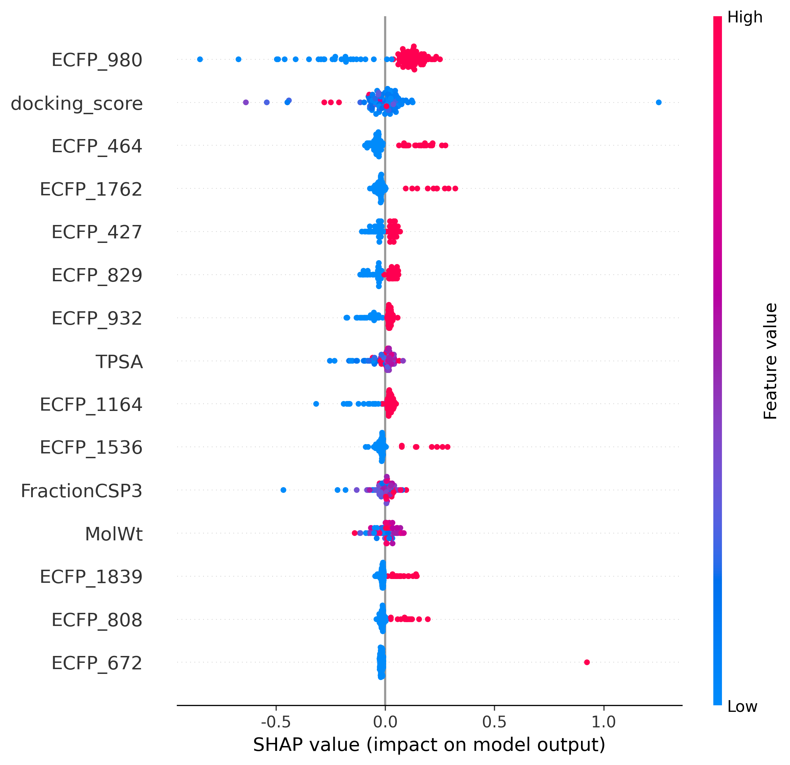

네, 맞습니다. 제가 드린 스크립트에는 ``와 같은 **이미지 삽입을 위한 마크다운 문장**이 빠져 있었습니다. 중요한 부분을 놓쳤습니다. 정말 죄송합니다.

`README.md`에 최종 결과 이미지를 포함하여 **전체 스크립트를 다시 수정**해서 드리겠습니다.

-----

# ASK1 저해제 pIC50 활성도 예측 AI 모델 개발

## 📜 프로젝트 개요

본 프로젝트는 신약 개발 초기 단계의 효율성을 높이기 위해, **ASK1 단백질 저해제의 pIC50 활성도를 예측하는 머신러닝 모델**을 개발하는 것을 목표로 합니다. 체계적인 데이터 처리, 피처 엔지니어링, 모델 최적화, 그리고 다양한 앙상블 기법을 적용하여 가장 성능이 뛰어난 예측 모델을 구축하고, SHAP 분석을 통해 모델의 예측 근거를 해석했습니다.

-----

## ✨ 주요 특징

  * **피처 엔지니어링**: 2D 피처(ECFP, 물리화학적 기술자)와 3D 피처(분자 도킹 점수)를 통합한 하이브리드 피처셋 사용
  * **모델 최적화**: `Optuna`를 이용한 1000회 이상의 하이퍼파라미터 튜닝 수행
  * **고급 앙상블**: 단순 앙상블을 넘어, **최적 가중치 앙상블** 및 **스태킹 앙상블** 등 고급 기법 적용
  * **모델 해석**: `SHAP` 분석을 통해 최종 모델의 예측 과정을 해석하고, 주요 피처의 영향력을 분석
  * **검증**: `Scaffold Split` 기반 5-Fold 교차 검증을 통해 모델의 일반화 성능을 신뢰성 있게 평가

-----

## 🚀 최종 결과

다양한 단일 모델과 앙상블 기법을 비교한 결과, **최적 가중치 앙상블(Optimal Weight Ensemble)** 모델이 **R² 0.426**으로 가장 우수한 종합 성능을 달성했습니다. 아래 그래프는 **베이스라인 모델**에서 시작하여 \*\*최고 단일 모델(Optimized)\*\*을 거쳐, 최종적으로 **최고 앙상블 모델**에 이르기까지의 성능 개선 과정을 한눈에 보여줍니다.


****

### SHAP 모델 해석

최고 성능 단일 모델인 LightGBM에 대한 SHAP 분석 결과, **`docking_score`**, **`ECFP_980`**, **`TPSA`** 등이 pIC50 예측에 중요한 영향을 미치는 것을 확인했습니다. 이는 모델이 화학적으로 유의미한 패턴을 학습했음을 시사합니다.

****

-----

## 🛠️ 기술 스택

  * **언어**: Python
  * **주요 라이브러리**:
      * **Data Handling**: Pandas, NumPy
      * **Cheminformatics**: RDKit, **Gnina**
      * **Machine Learning**: Scikit-learn, LightGBM, XGBoost
      * **Deep Learning**: PyTorch, Transformers (**MolBERT**), PyTorch Geometric (**GAT**)
      * **MLOps & Tuning**: Optuna, WandB
      * **Model Interpretation**: SHAP

-----

## 📁 프로젝트 구조

```
ASK1_portfolio/
├── data/
│   └── processed/
│       └── ask1_data_with_docking_scores.csv
├── models/
│   ├── best_lgbm_model.pkl
│   └── best_xgb_model.pkl
├── notebooks/
│   ├── 01_Data_Preprocessing.ipynb
│   ├── 02_Modeling_and_Tuning.ipynb
│   ├── 03_Train_and_Save_Models.ipynb
│   └── 04_Final_Analysis_and_Conclusion.ipynb
├── outputs/
│   └── figures/
│       ├── final_performance_dashboard.png
│       └── shap_summary_plot.png
├── environment.yml
└── README.md
```

-----

## 📖 실행 방법

1.  **Conda 가상환경 생성 및 활성화**:
    `environment.yml` 파일을 사용하여 프로젝트 실행에 필요한 모든 라이브러리를 한 번에 설치합니다.
    ```bash
    conda env create -f environment.yml
    conda activate ask1_project_new
    ```
2.  **Jupyter Notebook 실행**:
    `notebooks` 폴더로 이동하여 아래 순서대로 노트북을 실행합니다.
      * `01_Data_Preprocessing.ipynb`: 데이터 전처리
      * `02_Modeling_and_Tuning.ipynb`: 개별 모델 실험 및 튜닝
      * `03_Train_and_Save_Models.ipynb`: 최종 모델 훈련 및 저장
      * `04_Final_Analysis_and_Conclusion.ipynb`: 최종 분석 및 시각화

-----

## 💡 향후 개선 아이디어 (Future Work)

본 프로젝트는 성공적으로 pIC50 예측 모델을 구축했지만, SHAP 분석을 통해 얻은 인사이트를 바탕으로 다음과 같은 추가 실험을 진행하여 모델을 더 발전시킬 수 있습니다.

  * **주요 피처 상호작용 분석**: SHAP 분석에서 가장 중요하게 나타난 `docking_score`와 `ECFP_980`(특정 부분구조) 간의 상호작용(Interaction) 피처를 새로 생성하여 모델에 추가합니다. 이를 통해 두 피처의 시너지 효과를 모델이 학습할 수 있는지 검증하고, 성능을 추가적으로 개선할 수 있을 것으로 기대됩니다.